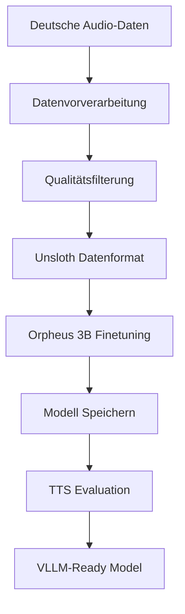

# Design Document

## Overview

Dieses Design beschreibt ein Pilotprojekt für deutsches TTS-Finetuning mit Orpheus 3B und Unsloth. Das System implementiert eine sequenzielle Pipeline mit klar getrennten Phasen: Datenvorverarbeitung, Finetuning und Evaluation. Der Fokus liegt auf pragmatischer Implementierung für schnelle Ergebnisse, nicht auf einem umfassenden Framework.

**Pilotprojekt-Ansatz:**
- Schnelle Iteration über vollständige Entwicklung
- Minimale aber funktionale Implementierung
- Fokus auf Proof-of-Concept statt Production-Ready System
- Manuelle Konfiguration statt automatisierte Parameter-Optimierung

### Technologie-Stack
- **Basis-Modell:** Orpheus 3B (VLLM-kompatibel)
- **Finetuning-Framework:** Unsloth (memory-efficient training)
- **Deployment:** VLLM für Inferenz
- **Entwicklungsumgebung:** Python VENV
- **Datenverarbeitung:** Python mit Audio-Libraries (librosa, soundfile)

## Architecture

### High-Level Pipeline



### Modulare Komponenten

1. **Data Preprocessing Module**
   - Audio-Metadaten-Extraktion
   - Qualitätsvalidierung
   - Text-Audio-Alignment

2. **Unsloth Training Module**
   - Orpheus 3B Modell-Loading
   - Memory-efficient Finetuning
   - Training-Monitoring

3. **Evaluation Module**
   - TTS-spezifische Metriken
   - Deutsche Sprach-Evaluation
   - Qualitäts-Assessment

4. **Model Persistence Module**
   - Modell-Speicherung nach Training
   - VLLM-Loading-Validierung

## Components and Interfaces

### 1. DataProcessor Class
```python
class DataProcessor:
    def extract_metadata(self, audio_files: List[Path]) -> Dict
    def validate_quality(self, audio_data: np.ndarray) -> bool
    def align_text_audio(self, text: str, audio: np.ndarray) -> float
    def filter_dataset(self, dataset: Dict) -> Dict
```

### 2. UnslothTrainer Class
```python
class UnslothTrainer:
    def load_orpheus_model(self) -> FastLanguageModel
    def prepare_dataset(self, data: Dict) -> Dataset
    def configure_training(self, config: TrainingConfig) -> None
    def start_finetuning(self) -> TrainingResults
```

### 3. TTSEvaluator Class
```python
class TTSEvaluator:
    def calculate_mos_approximation(self, audio: np.ndarray) -> float
    def measure_phoneme_accuracy(self, text: str, audio: np.ndarray) -> float
    def generate_evaluation_report(self, results: Dict) -> str
```

### 4. ModelPersistence Class
```python
class ModelPersistence:
    def save_model(self, model: Any, save_path: str) -> None
    def load_model_for_vllm(self, model_path: str) -> Any
    def validate_model_loading(self, model_path: str) -> bool
```

## Data Models

### AudioDataset
```python
@dataclass
class AudioDataset:
    file_path: Path
    text_transcript: str
    duration: float
    sample_rate: int
    quality_score: float
    metadata: Dict[str, Any]
```

### TrainingConfig
```python
@dataclass
class TrainingConfig:
    model_name: str = "orpheus-3b"
    learning_rate: float = 2e-4
    batch_size: int = 4
    max_seq_length: int = 2048
    num_epochs: int = 3
    use_unsloth_optimizations: bool = True
```

### EvaluationResults
```python
@dataclass
class EvaluationResults:
    mos_score: float
    phoneme_accuracy: float
    audio_quality_metrics: Dict[str, float]
    inference_speed: float
    model_size_mb: float
```

## Error Handling

### Data Processing Errors
- **Invalid Audio Format:** Automatische Konvertierung oder Ausschluss
- **Missing Transcripts:** Logging und Überspringen
- **Quality Threshold:** Konfigurierbare Schwellenwerte

### Training Errors
- **Memory Issues:** Unsloth's memory optimization nutzen
- **Convergence Problems:** Early stopping und Checkpoint-Recovery
- **Model Loading:** Fallback auf CPU wenn GPU nicht verfügbar

### Export Errors
- **VLLM Compatibility:** Detaillierte Validierung und Fehlerreports
- **Model Size:** Quantisierung als Fallback-Option

## Testing Strategy

### Unit Tests
- Jede Komponente isoliert testen
- Mock-Daten für Audio-Processing
- Unsloth-Integration mit kleinen Testmodellen

### Integration Tests
- End-to-End Pipeline mit Beispieldaten
- VLLM-Kompatibilität validieren
- Performance-Benchmarks

### Manual Testing
- Deutsche TTS-Qualität subjektiv bewerten
- Verschiedene Audio-Qualitäten testen
- Deployment-Szenarien durchspielen

### Test Data
- Kleiner deutscher Audio-Datensatz für Tests
- Synthetische Daten für Edge Cases
- Qualitäts-Referenz-Samples

## Implementation Notes

### Unsloth-Spezifische Optimierungen
- 4-bit Quantisierung für Memory-Efficiency
- LoRA (Low-Rank Adaptation) für schnelles Finetuning
- Gradient Checkpointing für große Modelle

### Orpheus 3B Konfiguration
- Spezielle Tokenizer-Einstellungen für deutsche Sprache
- Audio-Text-Mapping-Strategien
- VLLM-optimierte Export-Parameter

### Performance Considerations
- Batch-Processing für große Datensätze
- Checkpoint-System für lange Trainings
- Memory-Monitoring und -Optimierung

### German Language Specifics
- Deutsche Phonem-Mappings
- Umlaute und Sonderzeichen-Handling
- Dialekt-Berücksichtigung in Evaluation